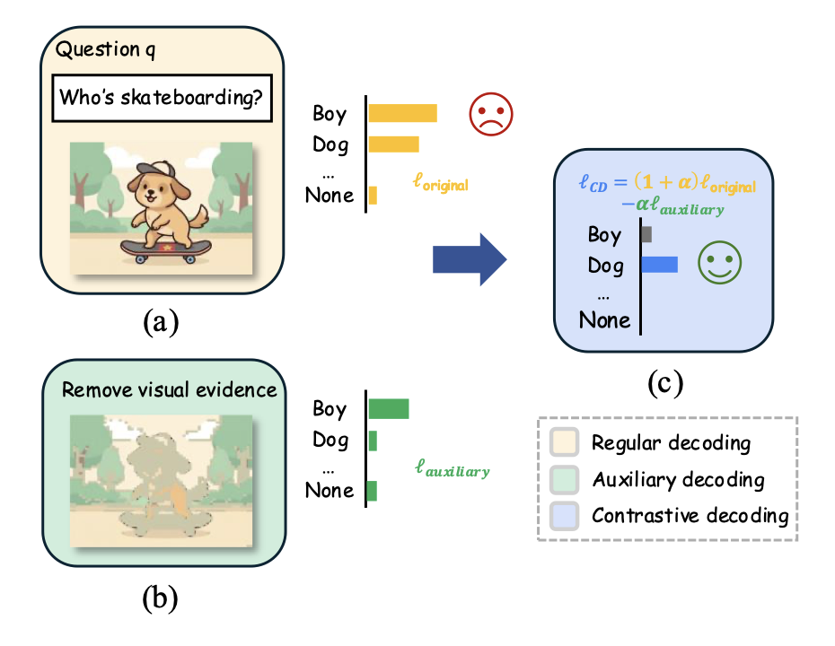
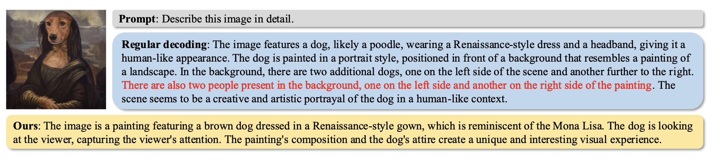
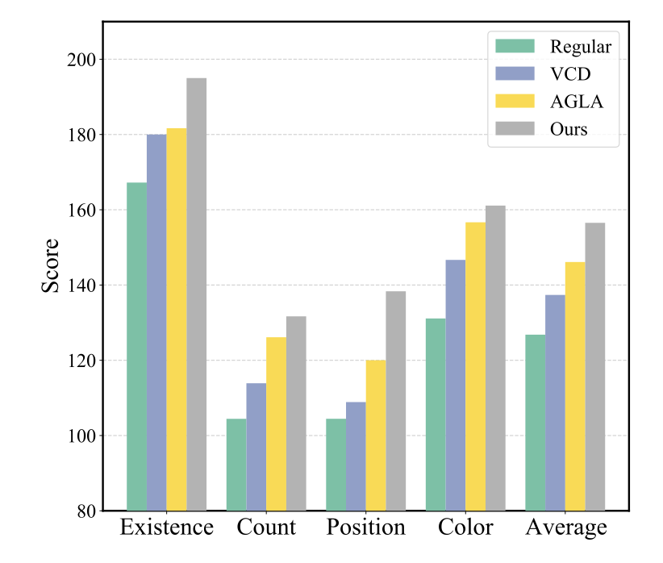

# Masking What Matters: A Smarter Way to Stop Vision-Language Models from Hallucinating

*Survey on the paper "Mask What Matters: Mitigating Object Hallucinations in Multimodal Large Language Models with Object-Aligned Visual Contrastive Decoding" by Boqi Chen, Xudong Liu, and Jianing Qiu (2026).*

Multimodal Large Language Models (MLLMs) are impressive at describing images, answering visual questions, and following complex instructions. However, they frequently suffer from so-called object hallucination, which occurs when a model confidently describes objects that simply are not present in the image. 

Imagine asking a model to describe a picture of a dog in a park. Because the model was trained on billions of text documents where dogs are often accompanied by cats or frisbees, its language bias might cause it to hallucinate a frisbee into the scene, even if the image does not show one.

Recently, researchers introduced a novel, training-free method to mitigate this called **Visual Contrastive Decoding (VCD)**. A new paper by researchers from ETH Zurich, Amazon, and MBZUAI introduces an elegant upgrade to this approach: **Object-Aligned Visual Contrastive Decoding (OA-VCD)**. By selectively masking the most important parts of an image, they force the model to rely on actual visual evidence rather than its own linguistic imagination.

Here is how it works in detail.

## The Status Quo: Visual Contrastive Decoding
To understand the new breakthrough, we first need to understand standard VCD. 

VCD works by comparing two different predictions from the model during the text generation phase:
1.  **The Original Prediction:** The model looks at the normal image and guesses the next word.
2.  **The Auxiliary Prediction:** The model looks at a corrupted or perturbed version of the image and guesses the next word.

The core idea is simple: if the model predicts the word *frisbee* when looking at the clear image, but also predicts the word *frisbee* when looking at a heavily blurred or distorted image, it means the model is not actually detecting the frisbee. It is just guessing based on language priors. VCD subtracts the auxiliary prediction from the original prediction, effectively suppressing these hallucinated, ungrounded words.

However, previous methods for corrupting the image are flawed. They relied on random noise, global blurring, or cross-modal models that depended heavily on the text prompt. These distortions are not aligned with the actual boundaries of objects in the image, meaning they might fail to properly obscure the visual evidence. 

## The Breakthrough: Masking What Matters
Instead of randomly distorting the image, the authors propose constructing an object-aligned auxiliary view. They achieve this by using the attention maps from a self-supervised Vision Transformer (specifically, DINO). 

Self-supervised models like DINO naturally learn to highlight the most prominent, semantically meaningful objects in an image without needing any text prompts or task-specific training. 

The researchers use this DINO attention map to locate the most salient visual evidence in the image. Then, they completely mask it out. 

By removing the main object (e.g., masking the dog with a neutral background color), the model is forced into a corner. If the model still tries to generate the word *dog* while looking at an image where the dog has been explicitly erased, it becomes obvious that the model is hallucinating. The contrastive decoding algorithm catches this and penalizes the hallucinated tokens, producing a more accurate final answer.

## Evaluation
The researchers tested OA-VCD on two popular object hallucination benchmarks: POPE and MME. They applied the method to two different widely-used open-source models: LLaVA-v1.5 (7B) and Qwen-VL (7B). 

The results were following:
* **Consistent Improvements:** Across different POPE evaluation subsets (Random, Popular, Adversarial), OA-VCD consistently outperformed both regular decoding and previous state-of-the-art VCD methods.
* **Stronger Contrast:** Masking salient regions from DINO attention yielded a much stronger and semantically targeted contrast signal than heuristic augmentations (like blurring).
* **Qualitative Coherence:** In complex case studies—such as describing a painting of a dog dressed like the Mona Lisa—regular decoding hallucinated non-existent people and additional dogs in the background. OA-VCD successfully removed these hallucinations without degrading the overall fluency or detail of the caption.

## Why this is a step forward
One of the most appealing aspects of this method is its efficiency. Mitigating hallucinations during inference often requires heavy computational overhead. However, extracting the DINO attention map to create the masked image only requires a single, cacheable forward pass. 

Furthermore, the method is entirely model-agnostic and prompt-agnostic. It does not rely on text-to-image alignment models that might introduce their own biases, and it can be plugged into almost any existing multimodal architecture. 

While it is not perfect—in highly cluttered scenes, the ViT might struggle to perfectly isolate the right objects—it proves that we don't always need to retrain massive models to make them more reliable. Sometimes, teaching a model to recognize its own hallucinations simply requires knowing exactly what to hide from it.

## Related Work

**1. Mitigating Object Hallucinations in Large Vision-Language Models through Visual Contrastive Decoding (Leng et al., 2024)**
This paper introduces the foundational Visual Contrastive Decoding (VCD) method, which contrasts a model's output distribution under the original image with a perturbed auxiliary view to suppress tokens driven by language priors. The authors use simple, heuristic methods like adding random noise to create these image perturbations. This paper is the direct predecessor to the paper analyzed above. OA-VCD builds precisely on this framework by replacing the noise-based image perturbation with a semantically meaningful, object-aligned mask to generate a stronger contrast signal.

**2. Mitigating Object Hallucinations in Large Vision-Language Models with Assembly of Global and Local Attention (An et al., 2024)**
This research mitigates hallucinations by combining global context with local discriminative features via an image-prompt matching scheme. It is known as AGLA, and it preserves prompt-relevant regions while masking distractors to construct its auxiliary views for contrastive decoding. Like the chosen paper, AGLA attempts to create more informative auxiliary views than simple noise. However, OA-VCD improves upon AGLA by being prompt-agnostic and avoiding cross-modal dependencies, relying instead on self-supervised Vision Transformer attention.

**3. VSCoDe: Visual Augmented Contrastive Decoding (Kim et al., 2024b)**
VSCoDe enhances visual contrastive decoding by dynamically selecting the most effective image perturbation from a pool of augmentations, such as blur, crop, or color changes. It chooses the specific augmentation that maximizes a softmax-distance criterion to strengthen the contrast signal during text generation. This paper shares the exact same core goal as OA-VCD: improving the quality of the auxiliary view for a better contrastive penalty. The chosen paper differentiates itself by noting that VSCoDe's perturbations remain image-level heuristics, whereas OA-VCD provides precise, object-level masking.

**4. Contrastive Response Generation for Mitigating Object Hallucination in LVLMs (Wan et al., 2024)**
This paper explores contrastive decoding from the textual side rather than the visual domain. It contrasts the model's output distributions under standard instructions versus disturbance instructions, such as adding specific role prefixes. By subtracting the disturbance-induced distribution, it aims to detach hallucinated concepts during the inference phase. While OA-VCD tackles hallucinations by perturbing the visual input, this paper provides a complementary approach, demonstrating that inference-time contrastive penalties are effective across multiple modalities.

**5. Evaluating Object Hallucination in Large Vision-Language Models (Li et al., 2023b)**
This work introduces the Polling-based Object Probing Evaluation (POPE) benchmark to systematically evaluate object hallucination in Multimodal Large Language Models. It formulates the evaluation as a structured binary classification task (answering Yes or No) regarding the existence of specific objects in an image. This paper is fundamentally related because it provides the primary evaluation framework used to measure the success of the OA-VCD method. The chosen paper demonstrates its real-world effectiveness by showing significant improvements in F1 and Accuracy scores specifically on the POPE benchmark compared to standard decoding.